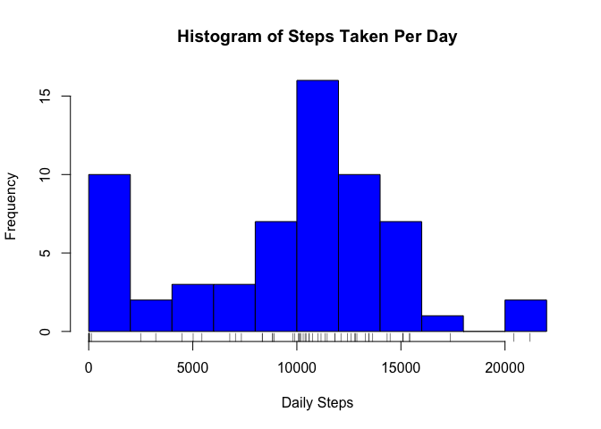
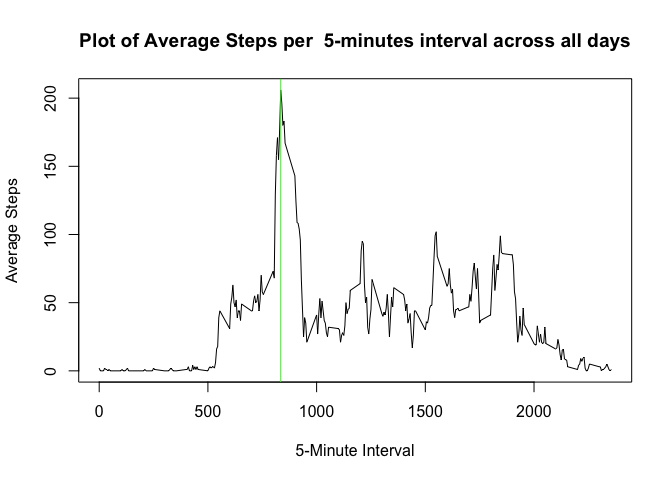
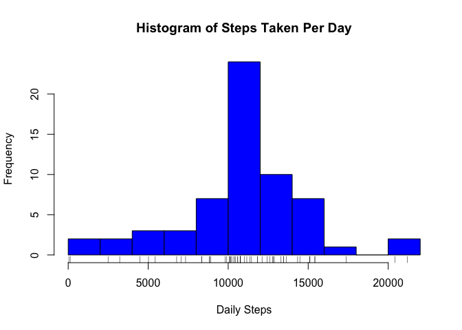
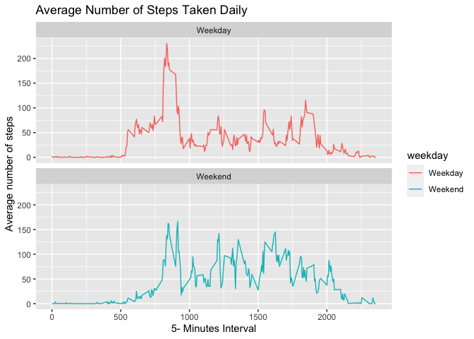

## Loading and preprocessing the data

We obtained the [activity monitoring data](https://d396qusza40orc.cloudfront.net/repdata%2Fdata%2Factivity.zip) which keeps track of the steps taken within a 5 minute interval for a period of two months.

**Load libraries**

We load the necessary packages for processing and analyzing the data.

```r
library(ggplot2)
library(dplyr)
```

```
## 
## Attaching package: 'dplyr'
```

```
## The following objects are masked from 'package:stats':
## 
##     filter, lag
```

```
## The following objects are masked from 'package:base':
## 
##     intersect, setdiff, setequal, union
```


```r
fileUrl<-"https://d396qusza40orc.cloudfront.net/repdata%2Fdata%2Factivity.zip"

## Check if the file exist else download and read the file
if(!file.exists("activity.csv")){
  unzip(download.file(url = fileUrl, destfile = "./activity.zip",
                      method = "curl"))
} else{  activity<- read.csv("activity.csv")
  
}
## Format date column into date format
activity$date<- as.Date(activity$date, "%Y-%m-%d")
accessDate<- Sys.time()
accessDate
```

```
## [1] "2021-02-15 09:06:07 EAT"
```


We get a big picture perspective of the data i.e. dimension of the data, structure and summaries.  
From the big picture we can see that the data has missing values. The minimum steps per 5 minute interval is 0 while the maximum steps being 806 and an average of 38 steps.


```r
dim(activity)
```

```
## [1] 17568     3
```

```r
str(activity)
```

```
## 'data.frame':	17568 obs. of  3 variables:
##  $ steps   : int  NA NA NA NA NA NA NA NA NA NA ...
##  $ date    : Date, format: "2012-10-01" "2012-10-01" ...
##  $ interval: int  0 5 10 15 20 25 30 35 40 45 ...
```

```r
summary(activity)
```

```
##      steps             date               interval     
##  Min.   :  0.00   Min.   :2012-10-01   Min.   :   0.0  
##  1st Qu.:  0.00   1st Qu.:2012-10-16   1st Qu.: 588.8  
##  Median :  0.00   Median :2012-10-31   Median :1177.5  
##  Mean   : 37.38   Mean   :2012-10-31   Mean   :1177.5  
##  3rd Qu.: 12.00   3rd Qu.:2012-11-15   3rd Qu.:1766.2  
##  Max.   :806.00   Max.   :2012-11-30   Max.   :2355.0  
##  NA's   :2304
```


## What is mean total number of steps taken per day?

From the histogram,the total number of steps taken in a day ranges from 0 to slightly over 21000 with most days having more than 10000 steps. The ***average*** number of steps taken per day is 9354 with a ***median*** of 10395 steps.


```r
dailySteps<-data.frame("TotalSteps"=tapply(activity$steps, 
                                                  activity$date,sum,
                                                  na.rm=TRUE))  

mean(dailySteps$TotalSteps, na.rm= TRUE)
```

```
## [1] 9354.23
```

```r
median(dailySteps$TotalSteps, na.rm = TRUE)
```

```
## [1] 10395
```

**Histogram of the Total Number of Steps Taken each Day**


```r
hist(dailySteps$TotalSteps,breaks = 10 ,xlab = "Daily Steps",
     main = "Histogram of Steps Taken Per Day", col = "blue")
rug(dailySteps$TotalSteps)
```

<!-- -->


## What is the average daily activity pattern?

The time series plot of the 5 minute interval shows that the average daily steps are 0 from midnight  to about 5:00 a.m   and later increases to a high of 206 steps at 8:35 a.m.  The average daily steps remain stable at about 1000 hrs to 1800hrs  and then tails off to zero as we approach midnight. Clearly, we can see that there is little that is done from 2100hrs to 0500hrs.


```r
dailyPattern<- activity %>% select(steps, interval) %>% group_by(interval)%>%
    summarise(steps= round(mean(steps, na.rm = TRUE)))
```

```
## `summarise()` ungrouping output (override with `.groups` argument)
```


```r
with( dailyPattern,plot(interval, steps, type = "l",
                        main = "Plot of Average Steps per  5-minutes interval across all days",
      xlab = "5-Minute Interval", 
      ylab ="Average Steps" ))


abline(v=dailyPattern$interval[which.max(dailyPattern$steps)], col= "green") 
```

<!-- -->


## Imputing missing values

**Check missing values**  

We can see that steps variable has 2304 missing values which accounts for just over 13% of all data.
The proportion is relatively low.


```r
## Check missing values, if they are missing values, how many and from which variables
data.frame("NACount" = sapply(activity, function(x) {length(which(is.na(x)))
}))
```

```
##          NACount
## steps       2304
## date           0
## interval       0
```

```r
## what percentage of data is missing?
mean(is.na(activity$steps))
```

```
## [1] 0.1311475
```


**Simple imputation** 

We choose to replace the missing values with the average of the 5-Minute interval across all days. 

```r
## create a copy of the data to be imputed
Imputed <- activity

## perform a simple imputation
Imputed$steps[which(is.na(Imputed$steps))] <-
  replace(Imputed$steps[which(is.na(Imputed$steps))],
          Imputed$interval[which(is.na(Imputed$steps))]%in% dailyPattern$interval
          , dailyPattern$steps)
## Check to see if all missing values have been replaced
length(which(is.na(Imputed)))
```

```
## [1] 0
```

**Total number of steps per day**  
After imputation, we find that the average daily steps median are almost the same.
The ***mean*** is 10766 while the ***median*** is 10762. The mean and median have substantially increased compared to when the missing values were ignored.


```r
dailyStepsImputed<-data.frame("TotalSteps"=tapply(Imputed$steps, 
                                            Imputed$date,sum,
                                           na.rm=TRUE))
mean(dailyStepsImputed$TotalSteps, na.rm = TRUE)  
```

```
## [1] 10765.64
```

```r
median(dailyStepsImputed$TotalSteps, na.rm = TRUE) 
```

```
## [1] 10762
```

**Histogram of the Total Number of Steps Taken each Day**  
From the histogram we can see that it is skewed to the right as a result of imputation. More than two-thirds of the days, the steps taken were greater than 10000

```r
hist(dailyStepsImputed$TotalSteps,breaks = 10 ,xlab = "Daily Steps",
     main = "Histogram of Steps Taken Per Day", col = "blue")
rug(dailyStepsImputed$TotalSteps)
```

<!-- -->


## Are there differences in activity patterns between weekdays and weekends?

The general pattern of activity does not vary so much between weekday and weekend. However, the average steps taken on weekend are higher than those on weekdays. The plot below clearly depicts this.


```r
Imputed$date<- as.Date(Imputed$date, "%Y-%m-%d")
## Create a factor variable of weekday and weekend from the date variable
Imputed<-Imputed %>% mutate(dayOfWeek= weekdays(date),
                            weekday=  as.factor(if_else(dayOfWeek =="Sunday"|
                                                          dayOfWeek=="Saturday", 
                                                        "Weekend", "Weekday")))

## Get the mean of weekdays and weekends 5-minute interval
ImputedPattern<-Imputed %>% group_by(weekday, interval) %>% 
  summarise(avg = mean(steps, na.rm = TRUE))
```

```
## `summarise()` regrouping output by 'weekday' (override with `.groups` argument)
```

                                             


```r
par(mar= c(4,4,2,2))
 ggplot(data = ImputedPattern, aes(interval, avg, color= weekday)) +
  geom_line() + facet_wrap(weekday~., nrow = 2) +
     labs(x= "5- Minutes Interval", y= "Average number of steps", title = "Average Number of Steps Taken Daily")
```

<!-- -->


